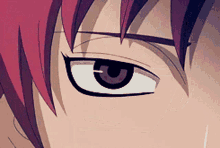

  

<table align="center">
  <tr>
    <td valign="middle">
      
    </td>
    <td valign="middle" align="left">
<pre>
a hobbyist custom rom/android developer
project lumina • minecraft java/be development • web + tooling

currently:
 • lumina client
 • ambient launcher 
 • essence
 • betafied addon
 • xiaomi BUS
</pre>
    </td>
  </tr>
</table>

   
  
  
  

---

## stack

  

---

## stats

  
  
    
  

---

## activity

  

---

 

  

